# AnswerFlow AI ⚡

AnswerFlow AI is a simpler, cheaper, AI-native platform designed to help B2B teams respond to RFPs, sales proposals, security questionnaires, and compliance forms in record time. 

Built using modern web standards (**Next.js 16, Prisma, Tailwind CSS, and SQLite**), AnswerFlow AI replaces manual copy-pasting, scattered Google Drive search sessions, and enterprise software bloat with a streamlined local-first RAG engine, similarity clustering, collaborative reviews, and multi-format document support.

---

## ✨ Features

### 🔍 Local-First RAG Engine
*   **BM25 + Cosine Similarity:** Integrates keyword-matching algorithms and TF-IDF Cosine Similarity for highly relevant source extraction.
*   **Synonym-Boosted Query Expansion:** Expands common technical terms (e.g., `SSO` $\rightarrow$ `Okta, SAML, OAuth`, or `backup` $\rightarrow$ `recovery, snapshots, DR`) to maximize matching reliability.
*   **Custom Persona & Tone Tuning:** Automatically formats draft answers based on 6 specialized communication profiles:
    *   `Concise` (short summaries)
    *   `Detailed` (bullet-point breakdowns)
    *   `Yes/No` (direct answer followed by context)
    *   `Formal` (polished B2B procurement language)
    *   `Security` (policy-verification format)
    *   `Plain` (simplified vocabulary)

### 📂 Multi-Format Document Parsing & Intake
*   **Knowledge Base Uploads:** Ingests standard `.txt`, `.pdf` (via `pdf-parse`), and `.docx` (via `mammoth`) documents. These are instantly sliced into vector-ready text chunks and cited as grounding evidence.
*   **Smart Column Mapping:** Provides an interactive Column Mapper UI for spreadsheet questionnaires (`.csv`, `.xlsx`), allowing teams to map raw question texts, categories, and locations instantly.

### 🤝 Collaborative Review Workspace
*   **Teammate Invitations:** Invite subject-matter experts and assign ownership of specific sections.
*   **Interactive Comments:** Leave context threads directly on questions to resolve technical gaps before final approval.
*   **Similarity Clusters:** Intelligently groups repetitive questions. Features a one-click **Propagate Answer** and **Bulk Approve** workflow to instantly resolve duplicates.

### 🛡️ Sensitive Claim Controls
*   **Automatic Risk Tagging:** Identifies questions flagged with sensitive compliance categories (e.g., `Compliance` or `Legal`).
*   **Redaction & Bypass:** Warns team members during exports if there are unapproved sensitive claims. Redacts unapproved claims automatically unless the manual administrative bypass is toggled.

### 📤 Premium Export Workflows
*   Download completed questionnaires in standard industry formats:
    *   **Excel Spreadsheet (`.xlsx`)** (perfectly formatted sheets)
    *   **Word Document (`.docx`)** (clean, styled paragraphs)
    *   **Comma-Separated Values (`.csv`)**
    *   **Structured JSON**

---

## 🛠️ Architecture & Tech Stack

```mermaid
graph TD
    A[User Client / UI] -->|Next.js 16 / React 19| B[API Layer Route Handlers]
    B -->|Prisma Client| C[SQLite database dev.db]
    B -->|Local RAG Engine| D[lib/rag.ts]
    D -->|BM25 / Cosine RAG| C
    B -->|Spreadsheet Engines| E[read-excel-file / write-excel-file]
    B -->|Document Parsers| F[pdf-parse / mammoth]
```



*   **Framework:** [Next.js 16 (App Router)](https://nextjs.org/) & [React 19](https://react.dev/)
*   **Database & ORM:** [Prisma ORM](https://www.prisma.io/) with an embedded [SQLite](https://sqlite.org/) database (`dev.db`).
*   **Styling:** Custom modern dark theme using [Tailwind CSS 3](https://tailwindcss.com/) with Lucide React Icons.
*   **Parsing Utilities:** `pdf-parse` (PDF extraction), `mammoth` (DOCX extraction), `docx` (Word generation), and `write-excel-file` / `read-excel-file`.
*   **Testing Infrastructure:** [Vitest](https://vitest.dev/) for unit/RAG testing and [Playwright](https://playwright.dev/) for End-to-End browser flow integration.

---

## 📦 Directory Structure

```
agy-software-2/
├── app/                  # Next.js App Router (pages and API endpoints)
│   ├── api/              # backend API routes (projects, library, parse-document, sources, users)
│   ├── projects/         # project manager & review workspaces
│   ├── sources/          # knowledge base management
│   ├── library/          # approved reusable Q&A library
│   └── team/             # teammate invitations & team directory
├── components/           # reusable frontend UI components (Navbar, etc.)
├── docs/                 # project axioms, target goal specs, and loops
├── lib/                  # shared prisma client and Local RAG search engine (rag.ts)
├── prisma/               # schema definitions and database seed scripts
├── scripts/              # local gate validation and secure environment integrity checks
└── tests/                # unit test suites (Vitest) & E2E integration suites (Playwright)
```

---

## 🚀 Local Development Setup

### 1. Prerequisites
Ensure you have [Node.js](https://nodejs.org/) (v18+) and `npm` installed.

### 2. Install Dependencies
Clone the repository and install all required modules:
```bash
npm install
```
*(This triggers a post-install hook running `node scripts/ensure-sqlite-db.mjs` to prepare your SQLite database).*

### 3. Initialize & Seed Database
AnswerFlow AI comes pre-packaged with a rich data seeding script containing realistic SSO policies, backup procedures, GDPR details, sample questionnaires, comments, and teammates.
```bash
npm run seed
```
This runs `prisma db push` to synchronize your schema and populates `dev.db` using `prisma/seed.ts`.

### 4. Run the Development Server
```bash
npm run dev
```
Open [http://localhost:3000](http://localhost:3000) in your browser to experience the dashboard.

---

## 🧪 Testing and Verification

To maintain systemic stability, AnswerFlow AI maintains a strict automated validation standard. All checks must remain fully green before pushes.

### Run Unit & RAG Calibration Tests
```bash
npm run test
```
*(Runs Vitest. Validates synonym expansion, tone formatting, database integrations, RAG scores, and duplicates).*

### Run End-to-End (E2E) Browser Tests
```bash
npm run test:e2e
```
*(Runs Playwright tests inside headless Chromium to simulate real-world CSV/PDF/DOCX uploading, RAG drafting, teammate assigning, cluster bulk actions, sensitive controls, and exports).*

### TypeScript Compilation check & Linter
```bash
npm run typecheck
npm run lint
```

---

## 🛡️ Repository Axioms & Loop Integration
AnswerFlow AI operates on strict codebase guidelines defined in `docs/AXIOMS.md`:
1. **Axioms are Sacred:** Never amended or bypassed except by explicit human intervention.
2. **Keep Main Green:** Only fully validated, green code is pushed.
3. **Preserve Every Attempt:** Archiving failed attempts for state analysis rather than hard-deleting.
4. **Substrate Automation Integrity:** Controlled by `assert-gate-integrity.ps1` to prevent modifications to core operations scripts listed in `manifest.txt`.

Developed with 💜 by Michael Crosato and the Google DeepMind Antigravity Team.

## 🤖 Autonomous agent workflow

AFK-capable agent sessions use dedicated root docs and scripts:
- Read `AGENTS.md`, `GOAL.md`, `ROADMAP.md`, and `docs/ai/REPO_MAP.md` before edits.
- Use `npm run agent:bootstrap` for first-run setup.
- Use `npm run agent:status` for quick context and `npm run agent:check` for lint/typecheck/test/format.
- Keep changes scoped by ticket in `tickets/TICKET*.md`.
